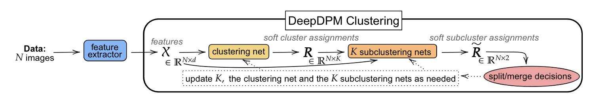

# DeepDPM：Deep Clustering With an Unknown Number of Clusters

## Preliminaries：DPGMM-based Clustering

令$\mathcal{X} = (x_i)_{i=1}^N$表示$N$个$\mathbb{R}^d$的数据。我们目的是将其聚类到$K$个类，其中$z_i$为类。类$k$包含所有标记为$k$的数据点$(x_i)_{i:z_i=k}$。混合高斯模型有拓展狄利克雷过程混合高斯模型(DPGMM)：
$$
p(x\mid (\mu_k, \Sigma_k,\pi_k)_{k=1}^\infty) = \sum_{k=1}^\infty \pi_k \mathcal{N}(x;\mu_k,\Sigma_k)
$$

## The Proposed Method：DeepDPM

### DeepDPM Under a Fixed $K$
给定$K$的当前值，数据首先被传入聚类网络$f_{\text{cl}}$，对于每一个数据点$x_i$，该网络生成K个soft cluster assignments：
$$
f_{\text{cl}}(\mathcal{X}) = \mathrm{R} = (r_i)_{i=1}^N\quad r_i = (r_{i,k})_{k=1}^K
$$
其中$\sum_{k=1}^K r_{i,k}=1$。之后我们计算$z_i = \arg\max_k r_{i,k}$。之后，对于每一个子聚类网络$f_{\text{sub}}^k,k\in\{1,\cdots,K\}$被输入与之相对应类的变量$\mathcal{X}_k = (x_i)_{i:z_i=k}$并且生成soft subcluster assignments：
$$
f_{\text{sub}}^k(\mathcal{X}_k) = \tilde{R}_k = (\tilde{r})_{i:z_i=k}\quad \tilde{r}_i = (\tilde{r}_{i,j})_{j=1}^2
$$
其中$\tilde{r}_{i,1} + \tilde{r}_{i,2}=1$。上面提到的$K+1$个网络都是隐藏层为$1$层的简单感知机。
我们下面引入由EM算法启发得到的损失函数，在E步骤，我们计算E-step概率，其中：
$$
r_{i,k}^E = \frac{\pi_k\mathcal{N}(x_i;\mu_k,\Sigma_k)}{\sum_{k^\prime=1}^K\pi_k^\prime \mathcal{N}(x_i;\mu_{k^\prime}, \Sigma_{k^\prime})}
$$
通过上一次迭代的$(\pi_k, \mu_k, \Sigma_k)_{k=1}^K$，我们定义损失函数：
$$
\mathcal{L}_{\text{cl}} = \sum_{i=1}^N\text{KL}(r_i\| r_i^E)
$$

对于子聚类网络，我们有损失：
$$
\mathcal{L}_{\text{sub}}= \sum_{k=1}^K\sum_{i=1}^{N_k}\sum_{j=1}^2 \tilde{r}_{i,j}\|x_i - \tilde{\mu}_{k,j}\|_{\ell_2}^2
$$

### Changing K via Splits and Merges
**Split**：在每个分隔步骤，我们将每一类分割为两个子类。每个分割以概率$\min(1,H_s)$被接受：
$$
H_s = \frac{\alpha\Gamma(N_{k,1})f_x(\mathcal{X}_{k,1};\lambda)\Gamma(N_{k,2})f_x(\mathcal{X}_{k,2};\lambda)}{\Gamma(N_k)f_x(\mathcal{X}_k;\lambda)}
$$
其中$\Gamma$为伽马函数，$\mathcal{X}_k = (x_i)_{i:z_i=k}$，$N_k = |\mathcal{X}_k|, \mathcal{X}_{k,j} = (x_i)_{i:(z_i,\tilde{z}_i) = (k,j)},N_{k,j}  = |\mathcal{X}_{k,j}|$，而$f_x(\cdot;\lambda)$为边缘似然而$\lambda$表示NIW分布的参数。为了应对$K$的增加，如果对于类$k$分割被接受，聚类网络的最后一层的第$k$个单元，以及将其与前面的隐藏层相连接的权重，被复制，我们使用学习到的子聚类的参数来初始化两个新的类的参数：

$$
\begin{aligned}
\mu_{k_1} \leftarrow \tilde{\mu}_{k,1}\quad & \Sigma_{k_1} \leftarrow \tilde{\Sigma}_{k,1}\quad &\pi_{k_1} \leftarrow \pi_k\times \tilde{\pi}_{k,1}\\
\mu_{k_2} \leftarrow \tilde{\mu}_{k,2}\quad & \Sigma_{k_2} \leftarrow \tilde{\Sigma}_{k,2}\quad &\pi_{k_2} \leftarrow \pi_k\times \tilde{\pi}_{k,2}
\end{aligned}
$$

**Merge**：在合并时我们必须考虑合并$k_1,k_2$和合并$k_2,k_3$不会同时发生，因为这样就成了同时合并三个类。为了避免这种事情产生，对于每个类别，我们只考虑最近的三个类别。我们的合并概率为$H_m = 1/H_s$。
合并类别$k_1,k_2$以$\min(1,H_m)$的概率：
$$
H_m = \frac{1}{H_s} = \frac{\Gamma(N_{k_1}+N_{k_2})f_x(\mathcal{X}_{\{k_1,k_2\}};\lambda)}{\alpha \Gamma(N_{k_1})f_x(\mathcal{X}_{k_1};\lambda)\Gamma(N_{k_2})f_x(\mathcal{X}_{k_2};\lambda)}
$$
其中$\mathcal{X}_{k_1,k_2} = (x_i)_{i:z_i\in(k_1,k_2)}$。如果合并被接受，两个类合并并且一个新的子类网络初始化。技术上，合并的网络的其中之一的最后一层的单元，以及与之连结的权重都从$f_{\text{cl}}$中移除，而新的网络的权重通过加权MAP估计初始化。

> 下面我们补充一些用到的知识：
> 在DPGMM中，我们每一个类的参数$\theta_k=(\mu_k,\Sigma_k)$的先验选择Inverse Wishart分布(IWD)，这是因为其与多元高斯分布共轭。

