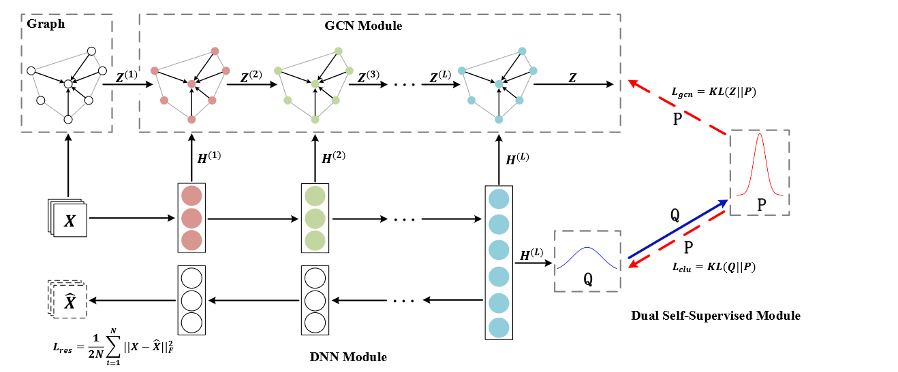

# Structural Deep Clustering Network

我们将图神经网络结合到神经网络的分类当中。具体来说，我们设计了一个传递算子来将自动编码器学到的表示转移到相应的GCN层，以及一个双重自监督机制来统一这两种不同的神经网络架构并指导整个模型的更新。

> SDCN的架构。其中$\mathrm{X,\hat{X}}$为输入数据和重建数据。$\mathrm{H}^{(l)},\mathrm{Z}^{(l)}$表示DNN和GCN的第$l$层。蓝色实心线表示目标分布$\mathrm{P}$是由$\mathrm{Q}$计算得到的，红色虚线表示自监督机制。

## The Proposed Model
### KNN Graph
假设我们有原始数据$\mathrm{X}\in \mathbb{R}^{N\times d}$，表示$N$行$d$维数据。对于每一个样本，我们首先选择前$K$个最相似的样本，然后与其连结。有很多方法计算邻接矩阵，我们列举两种最常用的方法：
1. **Heat Kernel**：样本$i,j$之间的相似度计算为：$$\mathrm{S}_{ij} = e^{-\frac{\|x_i-x_j\|^2}{t}}$$，其中$t$为热传导方程中的时间参数。
2. **点积**：$$\mathrm{S}_{ij} = \mathrm{x_j^T x_i}$$
### DNN Module
我们假设有$L$层，层的编号为$l$。详细地，在编码器第$l$层学到的表示可以由下列式子得到：
$$
\mathrm{H}^{(l)} = \phi\left(\mathrm{W_e^{(l)}H^{(l-1)}+b_e^{{(l)}}}\right)
$$
$\mathrm{H}^{(0)}$为原始数据$\mathrm{X}$。
同理，解码器为：
$$
\mathrm{H}^{(l)} = \phi\left(\mathrm{W_d^{(l)}H^{(l-1)}+b_d^{{(l)}}}\right)
$$
解码器的最后一层$\mathrm{X = H}^{(L)}$，目标函数为：
$$
\mathcal{L}_{\text{res}} = \frac{1}{2N}\sum_{i=1}^N\|\mathrm{x}_i - \hat{\mathrm{x}_i}\|_2^2 = \frac{1}{2N}\|\mathrm{X}-\hat{\mathrm{X}}\|_F^2
$$
### GCN Module
我们的第$l$层，可以由下式计算：
$$
\mathrm{Z}^{(l)} = \phi(\tilde{\mathrm{D}}^{-\frac{1}{2}}\tilde{\mathrm{A}}\tilde{\mathrm{D}}^{-\frac{1}{2}}\mathrm{Z}^{(l-1)}\mathrm{W}^{(l-1)})
$$
其中$\tilde{\mathrm{A}} = \mathrm{A+I}$，并且$\tilde{\mathrm{D}}_{ii} = \sum_j\mathrm{\tilde{A}}_{ij}$。我们将$\mathrm{Z}^{(l-1)},\mathrm{H}^{(l-1)}$结合，得到：
$$
\tilde{\mathrm{Z}}^{(l-1)} = (1-\epsilon)\mathrm{Z}^{(l-1)} + \epsilon \mathrm{H}^{(l-1)}
$$

之后我们用$\tilde{\mathrm{Z}}^{(l-1)}$作为输入来得到$\mathrm{Z}^{(l)}$，即：
$$
\mathrm{Z}^{(l)} = \phi(\tilde{\mathrm{D}}^{-\frac{1}{2}}\tilde{\mathrm{A}}\tilde{\mathrm{D}}^{-\frac{1}{2}}\mathrm{\tilde{Z}}^{(l-1)}\mathrm{W}^{(l-1)})
$$
注意，GCN的第一层的输入为原始数据$\mathrm{X}$：
$$
\mathrm{Z}^{(1)} = \phi(\tilde{\mathrm{D}}^{-\frac{1}{2}}\tilde{\mathrm{A}}\tilde{\mathrm{D}}^{-\frac{1}{2}}\mathrm{X}\mathrm{W}^{(1)})
$$
GCN的最后一层为一个多分类softmax函数：
$$
Z = \text{softmax}(\tilde{\mathrm{D}}^{-\frac{1}{2}}\tilde{\mathrm{A}}\tilde{\mathrm{D}}^{-\frac{1}{2}}\mathrm{Z}^{(L)}\mathrm{W}^{(L)})
$$
### Dual Self-Supervised Module
对于第$i$个样本和第$j$个聚类，我们采用学生$t$分布来作为核来测量数据表示$\mathrm{h}_i$和聚类中心$\mu_j$之间的相似度：
$$
q_{i j}=\frac{\left(1+\left\|\mathbf{h}_i-\boldsymbol{\mu}_j\right\|^2 / v\right)^{-\frac{v+1}{2}}}{\sum_{j^{\prime}}\left(1+\left\|\mathbf{h}_i-\boldsymbol{\mu}_{j^{\prime}}\right\|^2 / v\right)^{-\frac{v+1}{2}}}
$$
我们用$Q = [q_{ij}]$表示所有样本的分布。当得到聚类结果分布$\mathrm{Q}$，我们想要让数据点接近聚类中心，从而对聚类中心进行优化。因此，我们的目标分布$P$为：
$$
p_{ij} = \frac{q_{ij}^2/f_j}{\sum_{j^\prime }q^2_{ij^\prime}/f_{j^{\prime}}}
$$
其中$f_j = \sum_i q_{ij}$。那么我们的目标函数变为：
$$
\mathcal{L}_{\text{clu}} = \mathbb{KL}(P\|Q) = \sum_i\sum_j p_{ij}\log \frac{p_{ij}}{q_{ij}}
$$
我们之前也得到了$\mathrm{Z}$，同样的我们可以计算：
$$
\mathcal{L}_{\text{gcn}} = \mathbb{KL}(P\|Z) = \sum_{i}\sum_j p_{ij}\log \frac{p_{ij}}{z_{ij}}
$$
我们SDCN的总的损失函数为：
$$
\mathcal{L} = \mathcal{L}_{\text{res}} + \alpha\mathcal{L}_{\text{clu}} + \beta\mathcal{L}_{\text{gcn}}
$$
我们可以按照下式来对样本赋予类别：
$$
r_i = \arg\max_j z_{ij}
$$

