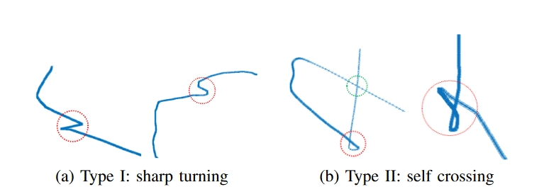
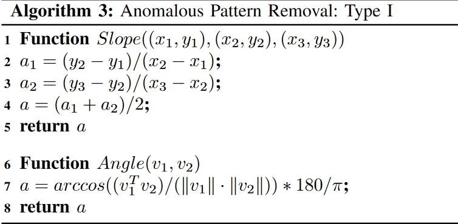
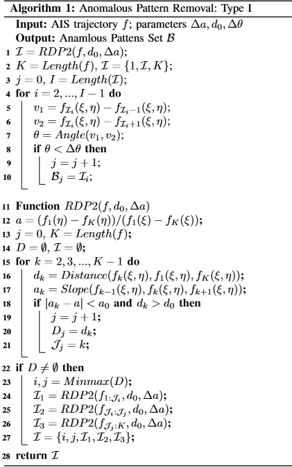

## Modeling Historical AIS Data For Vessel Path Prediction: A Comprehensive Treatment

我们首先定义一些符号。假设AIS轨迹集合包含$N$条轨迹$\{\gamma^{(1)},\gamma^{(2)},\cdots,\gamma^{(N)}\}$。在第$n$个轨迹的第$k$个数据表示为$\gamma_k^{(n)},k=1,\cdots,K_n$。注意$\gamma_k^{(n)}$为一个向量，包括很多元素，比如：

+ 纬度：$\gamma_k^{(n)}(\xi)$
+ 经度：$\gamma_k^{(n)}(\eta)$
+ 对地速度：$\gamma_k^{(n)}(sog)$
+ 对地方向：$\gamma_k^{(n)}(cog)$
+ 日期时间：$\gamma_k^{(n)}(\tau)$

#### Trajectory Outliers Detection

我们将轨迹的异常表示为以下两种：

+ sharp turning
+ self crossing

对于类型1，我们使用均值定理来执行一个改进的Ramer-Douglas-Peucker(RDP)算法。输入参数$d_0,\Delta a, \Delta \theta$分别为最小距离，slope tolerance between parallel lines和threshold for sharp turning。

对于类型2的问题，我们首先需要找到轨迹中两条线段的交点位置，然后判断交点是否异常。进一步，对于两条线段$P_1P_2$和$P_3P_4$，我们通过求解下列公式来找到$\alpha$和$\beta$：
$$
\begin{cases}
P^\star &= P_1 + \alpha(P_2-P_1)\\
P^\star &= P_3 + \beta(P_4-P_3)
\end{cases}
$$
两个线段相交当且仅当$\alpha \in [0,1]$和$\beta \in [0,1]$。之后我们对由$P^\star$开始并由$P^\star$结束的线段的长度进行检查，如果小于某个阈值则认为$P^\star$是异常值。

#### Trajectory Sample Representation

第一步是将不规则的时间差转为相同的时间差。令$\mathcal{S}$为样本集并且$\mathcal{T}$为对应的目标训练集。在这里每一个样本$s_i \in \mathcal{S}$为轨迹的一个小片段并且它的目标$f_t\in \mathcal{T}$为AIS信息，$f_t$为$s_i$中最后一条信息后的$\tau_t$时间段。

