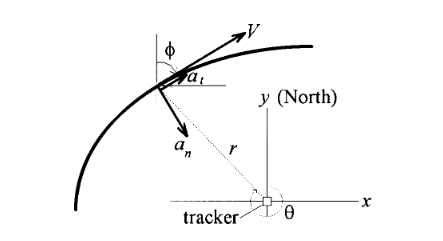

## Target Model

$a_n$法向加速度，$a_t$切向加速度。

连续时间的模型为：
$$
\begin{aligned}
\frac{d\phi}{dt} &= \frac{a_n(t)}{V(t)}\\
\frac{dV}{dt} &= a_t(t)\\
\frac{dx}{dt} &= V(t)\sin\phi(t)\\
\frac{dy}{dt} &= V(t)\cos\phi(t)
\end{aligned}
$$
我们很容易得到：
$$
\begin{bmatrix}\dot{x}(t)\\\ddot{x}(t)\\\dot{y}(t)\\\ddot{y}(t)\end{bmatrix} = \begin{bmatrix}0&1&0&0\\0&0&0&0\\0&0&0&1\\0&0&0&0\end{bmatrix}\begin{bmatrix}x(t)\\\dot{x}(t)\\y(t)\\\dot{y}(t)\end{bmatrix} + \begin{bmatrix}0&0\\\frac{\dot{x}(t)}{\sqrt{\dot{x}(t)^2+\dot{y}(t)^2}}&\frac{\dot{y}(t)}{\sqrt{\dot{x}(t)^2+\dot{y}(t)^2}}\\0&0\\\frac{\dot{y}(t)}{\sqrt{\dot{x}(t)^2+\dot{y}(t)^2}}&\frac{-\dot{x}(t)}{\sqrt{\dot{x}(t)^2+\dot{y}(t)^2}}\end{bmatrix}\begin{bmatrix}a_t\\a_n\end{bmatrix}
$$
即具有如下形式：
$$
\dot{x}(t) = Ax(t)+B(x(t))a(t)
$$
为了将上述模型离散化，需要假设样本间加速度的变化。为了对上式进行积分，我们写作：
$$
\begin{aligned}
\ddot{x}(t) &= a_t\sin\phi(t) + a_n\cos\phi(t)\\
\ddot{y}(t) &= a_t\cos\phi(t) - a_n\sin\phi(t)
\end{aligned}
$$
并且在区间$kT\le t < (k+1)T$将$a_t$和$a_n$看作是常数，但是考虑式$\frac{d\phi}{dt} = \frac{a_n(t)}{V(t)}$中$V(t)$在$\phi(t)$上的时变效应。式
$$
\ddot{\phi}(t) = \frac{\dot{a}_n(t)}{V(t)} - \frac{a_n(t)a_t(t)}{V(t)^2}
$$
> 我们有$\dot{\phi}(t) = \frac{a_n(t)}{V(t)}$，则
> $$
> \ddot{\phi}(t) = \frac{\dot{a}_n(t)V(t)- a_n(t)a_t(t)}{V^2(t)} =\frac{\dot{a}_n(t)}{V(t)} - \frac{a_n(t)a_t(t)}{V(t)^2}
> $$
> 

认为$a_t$和$a_n$为分段线性相当于假设：
$$
\left|\frac{\dot{a}_n(t)}{a_n(t)}\right| \ll \left|\frac{a_t(t)}{V(t)}\right|
$$
因此在$\dot{\phi}(t)$中可以忽略$a_n(t)$的变化而不是$V(t)$的变化。

另一个假设需要$a_t$足够小，从而使得在每一个更新区间上对$a_t$和$a_n$的值$u$进行积分成为可能。用这种方法得到了近似线性但时变的离散时间状态方程：
$$
\mathrm{x}((k+1)T) = F\mathrm{x}(kT) + G(kT)(\mathrm{u}(kT)+\mathrm{w}(kT))
$$
其中
$$
\begin{aligned}
F &= e^{AT}\\
G(kT) &= \int_{kT}^{(k+1)T}e^{A((k+1)T-\tau)}B(x(\tau))d\tau
\end{aligned}
$$

在更新中剩下的不可预测部分我们将其表示为均值为$0$的白噪声$\mathrm{w}$。我们假设：
$$
\begin{aligned}
E[\mathrm{w}(kT)] &= 0\\
E[\mathrm{w}(kT)\mathrm{w}((k-i)T)] &= Q\delta(i)
\end{aligned}
$$
假设$a_n(t)$和$a_t(t)$在区间$kT\le t < (k+1)T$上是常数，则:
$$
\begin{aligned}
\frac{\dot{x}(kT+\tau)}{\sqrt{\dot{x}^2(kT+\tau)+\dot{y}^2(kT+\tau)}} &= \sin(\phi(kT+\tau))\\
&= \sin\left(\phi(kT)+\int_{kT}^{kT+\tau}\frac{d\phi}{dt}dt\right)\\
&= \sin\left(\phi(kT)+\int_{kT}^{kT+\tau}\frac{a_n(kT)\dot{V}(t)}{a_t(kT)V(t)}dt\right)\\
&=\sin\left(\phi(kT)+\frac{a_n(kT)}{a_t(kT)}\ln\left(\frac{|V(kT+\tau)|}{|V(kT)|}\right)\right)
\end{aligned}
$$

> 这里的推导应该是这样来的：
>
> 因为$a_n(t)$和$a_t(t)$在$kT\le t < (k+1)T$上是常数，所以我们有$a_n(t) = a_n(kT), a_t(t) = a_t(kT)$，所以：
> $$
> \begin{aligned}
> \sin\left(\phi(kT)+\int_{kT}^{kT+\tau}\frac{d\phi}{dt}dt\right) &= \sin\left(\phi(kT)+\int_{kT}^{kT+\tau}\frac{a_n(t)}{V(t)}\frac{\dot{V}(t)}{a_t(t)}dt\right)\\
> &= \sin\left(\phi(kT)+\int_{kT}^{kT+\tau}\frac{a_n(kT)\dot{V}(t)}{a_t(kT)V(t)}dt\right)
> \end{aligned}
> $$
> 

更进一步：
$$
V(kT+\tau) = V(kT) + a_t(kT)\tau\quad 0\le \tau < T
$$
替换后得到：
$$
\begin{aligned}
&\frac{\dot{x}_{k T+\tau}}{\sqrt{\dot{x}_{k T+\tau}^2+\dot{y}_{k T+\tau}^2}}=\sin \left(\phi_k+\frac{a_{n_k}}{a_{t_k}} \ln \left(1+\frac{a_{t_k}}{V_k} \tau\right)\right) \\
&\frac{\dot{y}_{k T+\tau}}{\sqrt{\dot{x}_{k T+\tau}^2+\dot{y}_{k T+\tau}^2}}=\cos \left(\phi_k+\frac{a_{n_k}}{a_{t_k}} \ln \left(1+\frac{a_{t_k}}{V_k} \tau\right)\right)
\end{aligned}
$$
为了简化$G(k)$的计算，我们进一步假设：
$$
\ln\left(1+\frac{a_{tk}}{V_k}\tau\right) = \frac{a_{tk}}{V_k}\tau - \frac{(a_{tk})^2}{2V_k^2}+\cdots \approx \frac{a_{tk}}{V_k}\tau
$$
所以我们的模型变为：
$$
\begin{aligned}
&\left[\begin{array}{l}
x_{k+1} \\
\dot{x}_{k+1} \\
y_{k+1} \\
\dot{y}_{k+1}
\end{array}\right]=\left[\begin{array}{cccc}
1 & T & 0 & 0 \\
0 & 1 & 0 & 0 \\
0 & 0 & 1 & T \\
0 & 0 & 0 & 1
\end{array}\right]\left[\begin{array}{l}
x_k \\
\dot{x}_k \\
y_k \\
\dot{y}_k
\end{array}\right]\\+
&\left[\begin{array}{cc}
\frac{1}{\omega_k} T \cos \phi_k+\frac{1}{\omega_k^2} \sin \phi_k-\frac{1}{\omega_k^2} \sin \left(\phi_k+\omega_k T\right) & \frac{1}{\omega_k^2} \cos \phi_k-\frac{1}{\omega_k} T \sin \phi_k-\frac{1}{\omega_k^2} \cos \left(\phi_k+\omega_k T\right) \\
\frac{1}{\omega_k} \cos \phi_k-\frac{1}{\omega_k} \cos \left(\phi_k+\omega_k T\right) & \frac{1}{\omega_k} \sin \left(\phi_k+\omega_k T\right)-\frac{1}{\omega_k} \sin \phi_k \\
\frac{1}{\omega_k^2} \cos \phi_k-\frac{1}{\omega_k} T \sin \phi_k-\frac{1}{\omega_k^2} \cos \left(\phi_k+\omega_k T\right) & \frac{1}{\omega_k^2} \sin \left(\phi_k+\omega_k T\right)-\frac{1}{\omega_k^2} \sin \phi_k-\frac{1}{\omega_k} T \cos \phi_k \\
\frac{1}{\omega_k} \sin \left(\phi_k+\omega_k T\right)-\frac{1}{\omega_k} \sin \phi_k & \frac{1}{\omega_k} \cos \left(\phi_k+\omega_k T\right)-\frac{1}{\omega_k} \cos \phi_k
\end{array}\right]\left[\begin{array}{l}
a_t \\
a_n
\end{array}\right]_k
\end{aligned}
$$
其中
$$
\phi_k = \arctan\frac{\dot{x}_k}{\dot{y}_k}\quad w_k =\frac{a_{nk}}{\sqrt{\dot{x}_k^2 + \dot{y}_k^2}}
$$

我们可以将上式写为：
$$
\begin{aligned}
{\left[\begin{array}{l}
x_{k+1} \\
\dot{x}_{k+1} \\
y_{k+1} \\
\dot{y}_{k+1}
\end{array}\right]=} & {\left[\begin{array}{cccc}
1 & \frac{1}{\omega_k} \sin \omega_k T & 0 & \frac{1}{\omega_k}\left(1-\cos \omega_k T\right) \\
0 & \cos \omega_k T & 0 & \sin \omega_k T \\
0 & \frac{1}{\omega_k}\left(\cos \omega_k T-1\right) & 1 & \frac{1}{\omega_k} \sin \omega_k T \\
0 & -\sin \omega_k T & 0 & \cos \omega_k T
\end{array}\right]\left[\begin{array}{c}
x_k \\
\dot{x}_k \\
y_k \\
\dot{y}_k
\end{array}\right] } \\
+& {\left[\begin{array}{c}
\frac{1}{\omega_k} T \cos \phi_k+\frac{1}{\omega_k^2} \sin \phi_k-\frac{1}{\omega_k^2} \sin \left(\phi_k+\omega_k T\right) \\
\frac{1}{\omega_k} \cos \phi_k-\frac{1}{\omega_k} \cos \left(\phi_k+\omega_k T\right) \\
\frac{1}{\omega_k^2} \cos \phi_k-\frac{1}{\omega_k} T \sin \phi_k-\frac{1}{\omega_k^2} \cos \left(\phi_k+\omega_k T\right) \\
\frac{1}{\omega_k} \sin \left(\phi_k+\omega_k T\right)-\frac{1}{\omega_k} \sin \phi_k
\end{array}\right] a_t }
\end{aligned}
$$
