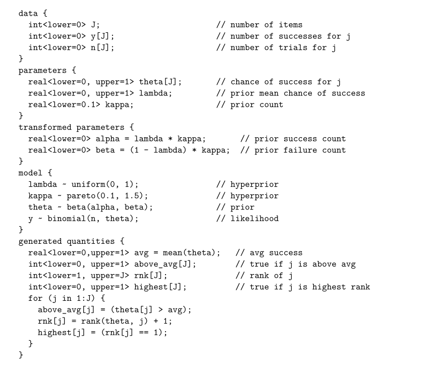

## Stan: A Probabilistic Programming Language

### Core functionality

#### Program for estimating a Bernoulli parameter

假设我们的数据`y[1],. . ., y[n]`式独立同分布的，我们要估计伯努利分布的参数$\theta$。

~~~stan
data {
	int<lower=0> N;     // 样本数量
	int<lower=0, upper=1> y[n];    // 样本
}

parameters {
	real<lower=0, upper=1> theta;
}

model {
	theta ~ beta(1, 1);   // prior
	y ~ bernoulli(theta); // likelihood
}
~~~

#### Data format

所有在生命在`data`中的变量都必须事先定义，如：

~~~R
N <- 10
y <- c(0, 1, 0, 0, 0, 0, 0, 0, 0, 1)
~~~

### Data Type

`stan`中所有数据类型都是静态的，需要在编译前确定数据类型并且不可更改。

#### Primitive types

`stan`中的原始类型为`real`和`int`类型，分别对应于`C++`中`double`和`int`类型。

#### Vector and matrix types

`stan`支持向量、行向量和矩阵，索引方法类似于R和Matlab，从$1$开始，并且`a[2:4]`包含`a[2],a[3],a[4]`。可以省略一个或两个边界，在这种情况下，它们默认为向量中的第一个和最后一个元素。例如，`a[3:]`比`a`少两个元素，并且`a[3:][i]`定义为`a[2 + i]`。如果`n`为一个整数的数组，则`a[n]`为与`n`有同样大小的向量，并且`a[n][i]`定义为`a[n[i]]`。

#### Array types

`Array`的元素的类型可以为任何类型，既可以是`real`、`inter`也可以是向量、矩阵类型。

#### Constrained variable types

我们可以对数据添加限制：

1. Int和real一般设置上下界：lower和upper。
2. 向量：
   1. 单纯形(所有元素非负且和为$1$)：`simplex[K]`
   2. 单位长度向量(模为$1$)：`unit_vector[K]`
   3. 排序(元素为升序)：`ordered[K]`
   4. 正序(元素为降序)：`positive_ordered[K]`
3. 矩阵
   1. 协方差或者精度矩阵(对称、正定)：`cov_matrix[K]`
   2. 相关矩阵(对称、正定、单位对角元素)：`corr_matrix[K]`

### Top-level blocks and program execution

我们后面都将以下面的程序作为例子：

#### Data block

一个`stan`程序以`data block`为开始，声明拟合模型所需要的数据。

#### Transformed data block

上述例子中没有使用Transformed data block，其可用于定义可基于数据计算的新变量，例如对数据进行归一化：

~~~stan
transformed data {
	vector[N] x_std = (x - mean(x)) / sd(x);
}
~~~

#### Parameter block

在上面的例子中定义了三个参数。参数block每次计算log概率密度的时候都会执行一次。

#### Transformed parameters block

`Transformed parameters block`允许我们定义参数的变换。`Transformed parameters block`在参数块之后执行，之后检验其是否符合约束。

#### Model block

模型块里面写的是求解对数概率密度的过程。

### Statements

`stan`支持`print`语句，方便我们对结果进行调试：

~~~stan
transformed parameters {
	cov_matrix[K] sigma;
	for (m in 1:M)
		for (n in m:M)
			Sigma[m, n] <- Omega[m,n] * sigma[m] * sigma[n];
	print("Sigma=", Sigma);
}
~~~

我们也可以使用`reject`语句抛出错误，停止程序的执行：

~~~stan
if (n > size(x))
	reject("Index out of bounds, n = ", n, "; required n < size(x) = ", size(x));
~~~

