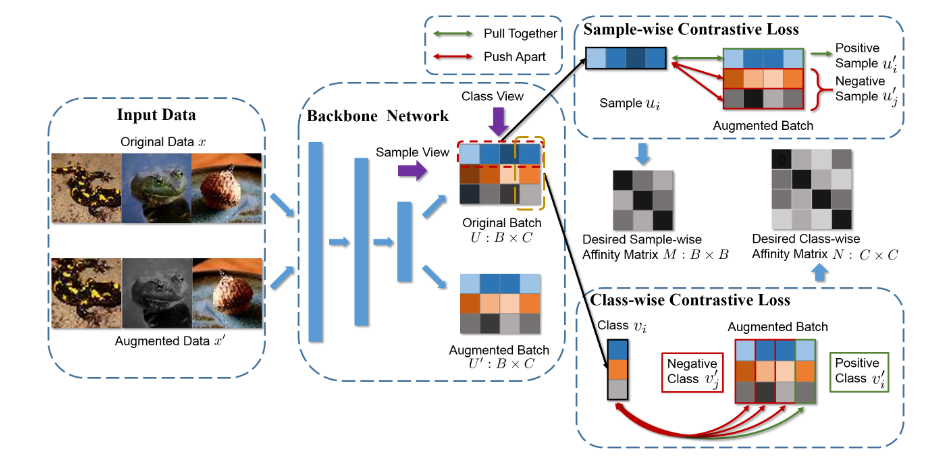
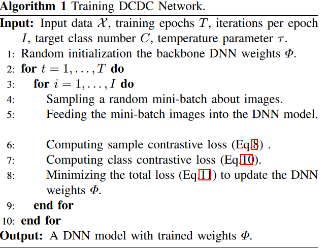

# Doubly Contrastive Deep Clustering

## Doubly Contrastive Deep Clustering

我们主要对互信息进行优化，但是由于互信息不太好显式计算，我们选择优化互信息的下界。

令$x,x^\prime\in \mathcal{X}$为来自于联合概率分布$p(x, x^\prime)$的样本。我们用$x$表示原始数据，$x^\prime$表示数据增强后的数据。我们的框架旨在学习一个DNN映射$\Phi: \mathcal{X}\rightarrow \mathcal{Y}$来发现$x,x^\prime$之间的信息，其中$\mathcal{X} = \{(x_1,x_1^\prime),(x_2,x_2^\prime),\cdots,(x_N,x_N^\prime)\}$并且$\mathcal{Y} = \{1,2,\cdots,C\}$。

### InfoNCE Loss

互信息定义为：

$$
I(x,x^\prime) = \sum_{x,x^\prime}p(x,x^\prime)\log \frac{p(x^\prime \mid x)}{p(x^\prime)}
$$

通过最大化$x,x^\prime$的互信息，我们可以得到更加稳健和区分度的深度特征。但是对$p(x^\prime\mid x)$对于学习$x,x^\prime$之间更一般的信息不是最优的。因此，我们保持$x,x^\prime$之间的密度比值：

$$
f(x,x^\prime) \propto \frac{p(x^\prime \mid x)}{p(x^\prime)}
$$

因为$p(x^\prime),p(x^\prime \mid x)$不能被直接估计，我们可以使用这些分布中的样本。以这种方式，Noise-Constrastive Estimation(NCE)和Importance Sampling技术可以被用来比较目标值和随机选择的负样本值。

根据BCE，给定含有$N$个样本的数据集，包含一个正样本$x^\prime$从条件分布$p(x^\prime\mid x)$中采样得到，和$N-1$个负样本来自于分布$p(x^\prime)$，我们给定InfoNCE如下：

$$
\mathcal{L}_{\text{InfoNCE}}  = -\mathbb{E}\left[\log \frac{f(x_i,x_i^\prime
)}{\sum_{j=1}^N f(x_i,x_j^\prime)}\right]
$$

样本$x_i^\prime$是从条件分布$p(x^\prime\mid x)$中而不是$p(x^\prime)$中采样得到的概率为：

$$
\begin{aligned}
    p_{\text{pos}} &= \frac{p(x^\prime_i\mid x_i)\prod_{m\neq i}p(x_m^\prime)}{\sum_{j=1}^N p(x_j^\prime \mid x_i)\prod_{m\neq j}p(x^\prime_m)}\\
    &= \frac{\frac{p(x_i^\prime \mid x_i)}{p(x_i^\prime)}}{\sum_{j=1}^N \frac{p(x_j^\prime \mid x_i)}{p(x_j^\prime)}}
\end{aligned}
$$

有文献证明InfoNCE为MI的下界：

$$
I(x,x^\prime) \ge \log(N) - \mathcal{L}_{\text{InfoNCE}}
$$

### DCDC Loss

> DCDC网络架构

#### sample-wise Contrastive Loss

从采样的角度，$x,x^\prime$应该被分为同一类，它们的聚类结果$u\in \mathbb{R}^{C\times 1},u^\prime \in \mathcal{R}^{C\times 1}$。我们使用余弦相似度来衡量相似：

$$
\cos(u,u^\prime) = \frac{u^Tu^\prime}{\|u\|_2\|u^\prime\|_2}
$$

两个仿射矩阵可以定义为：$M = \cos(UU^\prime T),N=\cos(U^TU^\prime)$。密度比率$f$定义为：

$$
f(u, u^\prime) = \exp(\cos(u,u^\prime)/\tau)
$$

其中$\tau > 0$为温度参数。

我们得到sample-wise contrastive loss为：

$$
\mathcal{L}_{\text{sample}} = -\mathbb{E}\left[\log \frac{\exp(\cos(u_i,u_i^\prime)/\tau)}{\sum_{j=1}^B\exp(\cos(u_i,u_j^\prime)/\tau)}\right]
$$

#### Class-wise Contrastive Loss

与sample-wise类似，我们有：

$$
\mathcal{L}_{\text{class}} = -\mathbb{E}\left[\log \frac{\exp(\cos(v_i,v_i^\prime)/\tau)}{\sum_{j=1}^C\exp(\cos(v_i,v_j^\prime)\tau)}\right]
$$

那我们总的损失函数为：

$$
\mathcal{L} = \mathcal{L}_{\text{sample}} + \mathcal{L}_{\text{class}}
$$

